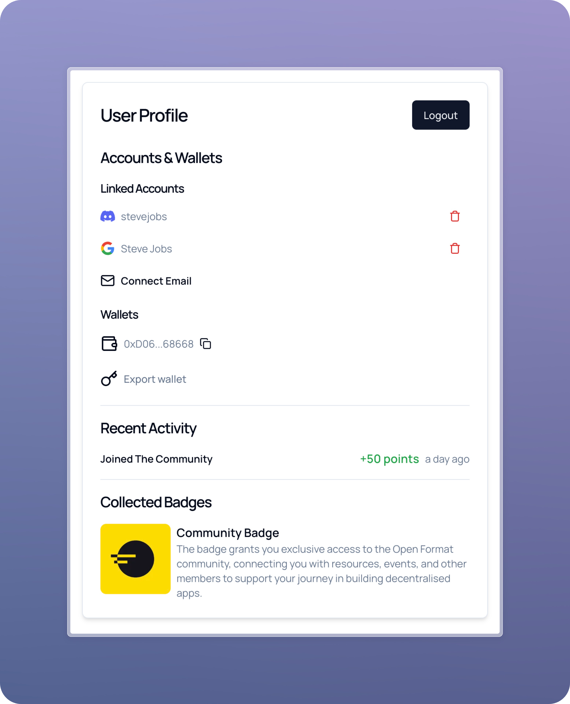

# Open Format Next JS starter

<div align="center">
  
</div>

A Next.js template demonstrating how to easily onboard users into web3 using [Privy](https://privy.io). Users can view their recent activity and collected badges from your [Open Format dApp](https://app.openformat.tech).

## Features

- 📈 Shows the recent user activity and badges collected from an Open Format dApp
- 🔐 Authentication with multiple providers:
  - Discord
  - Google
  - Email
- 🌓 Dark/Light mode toggle
- 🎨 Clean UI with [Shadcn](https://ui.shadcn.com)
- ⚡️ Built with Next.js 14

## Getting Started

### Prerequisites

Before you begin, you'll need to set up accounts and configure a few services:

1. **Open Format Dashboard**

   - Create an account at [Open Format Dashboard](https://app.openformat.tech)
   - Create a new dApp to get your `OPENFORMAT_DAPP_ID`
   - Generate an API key to get your `OPENFORMAT_API_KEY`

2. **Privy Dashboard**
   - Create an account at [Privy Dashboard](https://dashboard.privy.io)
   - Create a new app to get your `NEXT_PUBLIC_PRIVY_APP_ID` from the Settings section of your Privy app
   - In the Login Methods section of your Privy app, enable:
     - Discord
     - Google
     - Email

### Deploy

Instantly deploy your own copy of the template using Vercel or Netlify:

[](https://vercel.com/new/clone?repository-url=https%3A%2F%2Fgithub.com%2Fopen-format%2Fnext-js-starter&env=NEXT_PUBLIC_PRIVY_APP_ID,OPENFORMAT_API_KEY,OPENFORMAT_DAPP_ID) [](https://app.netlify.com/start/deploy?repository=https://github.com/open-format/next-js-starter)

### Local Development

1. Clone the repository:

   ```bash
   git clone https://github.com/open-format/next-js-starter.git
   cd next-js-starter
   ```

2. Install dependencies:

   ```bash
   npm install
   # or
   yarn install
   # or
   pnpm install
   ```

3. Create a `.env.local` file in the root directory and add your Privy App ID:

   ```bash
   NEXT_PUBLIC_PRIVY_APP_ID=your_privy_app_id
   ```

4. Start the development server:

   ```bash
   npm run dev
   # or
   yarn dev
   # or
   pnpm dev
   ```

5. Open [http://localhost:3000](http://localhost:3000) in your browser to see the application.

## Environment Variables

| Variable                   | Required | Example                                      | Description                                                                                                                                          |
| -------------------------- | -------- | -------------------------------------------- | ---------------------------------------------------------------------------------------------------------------------------------------------------- |
| `NEXT_PUBLIC_PRIVY_APP_ID` | Yes      | `cgg24287yq0273ryeh719gutpc`                 | Your [Privy](https://privy.io) application ID                                                                                                        |
| `OPENFORMAT_API_KEY`       | No       | `b31e8e6c-d43b-4b37-aee9-621egg415b8e`       | Required to display Recent Activity and Collected Badges in your dApp. Generate API Key in the Open Format [Dashboard](https://app.openformat.tech). |
| `OPENFORMAT_DAPP_ID`       | No       | `0x0747d8a6e968422a4e506e820f51efaef757956c` | Required to display Recent Activity and Collected Badges in your dApp. Create dApp in the Open Format [Dashboard](https://app.openformat.tech).      |

## Contributing

Contributions are welcome! Please feel free to submit an issue.
